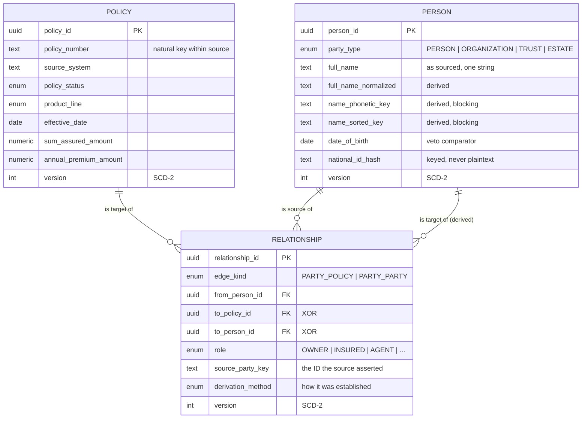

# Canonical Data Model

Step 1 of the Customer MDM build. This defines the three canonical entities, how
identity is established for each, and how the model supports the vectorized
matching and AI-fallback stages that follow.

---

## 0. Assumptions taken

I asked four questions before starting and didn't get answers, so I've taken the
following defaults. Each is cheap to change now and expensive later, so flag any
you disagree with before step 2.

| # | Decision | Taken | Why |
|---|---|---|---|
| 1 | Source data | Representative insurance policy schema plus a declarative source→canonical mapping layer | Swapping in your real extract becomes a mapping config change, not a schema rewrite. Give me a sample header and I'll conform the model to it. |
| 2 | Identity keys | **Hybrid.** `OwnerCustomerId` / `InsuredCustomerId` / `AgentCode` are authoritative *within* a source system, probabilistic *across* systems | This is the only reading where the AI fallback has real work to do. If IDs were globally authoritative there is no MDM problem to solve; if they were worthless we'd be discarding good evidence. |
| 3 | Versioning | SCD-2 on all golden records, plus per-attribute provenance and an append-only decision audit | "Why does this record look like this?" is the question stewards actually ask. Bitemporal is available as an extension if you need retro-corrections. |
| 4 | Relationships | Sourced Person↔Policy role edges, plus **derived** Person↔Person edges | Householding, cross-sell and agent-book views all need the second kind. Household stays a derived cluster rather than a 4th entity, keeping the count at 3. |

Two further defaults worth surfacing explicitly:

- **Owners are often not people.** Trusts, estates and companies routinely own
  insurance policies, and agents are frequently agencies. `Person` therefore
  carries a `party_type` discriminator rather than assuming a natural person.
- **Money is `decimal(18,4)`, never a float.** Premiums get summed and
  reconciled against carrier ledgers; float drift would make those sums
  irreproducible.

---

## 1. The three entities



### Policy

The insurance contract, and **the grain the data arrives in**. One inbound row
carries the contract terms plus party details for each role; ingestion splits it
into one Policy, N Person and N Relationship records.

Policy identity is essentially deterministic: a policy number is unique within
its issuing system, so the natural key is
`(source_system, policy_number_normalized)` and no probabilistic matching is
needed. The normalized form sits beside the raw one because `POL-001234` and
`pol1234` are the same contract but only one form can be displayed back
unchanged.

### Person

The party — natural or legal — acting in a policy role.

Person is where the actual MDM problem lives, because **Person has no natural
key**. See §2.

### Relationship

The role-bearing edge, in two shapes under one discriminator:

- **`PARTY_POLICY`** — asserted by the source. "This person is the owner of that
  policy", together with the source identifier that made the claim. This is the
  many-to-many the requirement describes, with role as a first-class attribute
  rather than three columns bolted onto Policy.
- **`PARTY_PARTY`** — derived by traversing the first kind. Two insureds on one
  policy are co-insured; an owner and an insured on one policy are connected;
  every party an agent writes for is serviced by that agent.

Derived edges are **stored, not computed on read** — the traversal is expensive
and these drive householding and cross-sell queries that run constantly. Every
derived edge carries `evidence_policy_ids` and is fully recomputable from
scratch.

One table with an XOR check constraint, not two, so graph traversal queries stay
uniform:

```sql
CONSTRAINT ck_relationship_target CHECK (
    (edge_kind = 'PARTY_POLICY' AND to_policy_id IS NOT NULL AND to_person_id IS NULL)
    OR (edge_kind = 'PARTY_PARTY' AND to_person_id IS NOT NULL AND to_policy_id IS NULL)
)
```

---

## 2. Person identity: the crux

The three source identifiers are authoritative within their source system and
meaningless across systems. Worse, the same human commonly holds all three in
different capacities — an agent who also owns a policy and is insured on their
spouse's.

So `person_id` is a surrogate, and identity lives in the **`person_xref`
crosswalk**:

```
(source_system, source_key_kind, source_party_key) ──many-to-one──> person_id
```

| source_system | source_key_kind | source_party_key | person_id |
|---|---|---|---|
| LIFE_ADMIN | OWNER_CUSTOMER_ID | C-88213 | `018f…a91` |
| LIFE_ADMIN | INSURED_CUSTOMER_ID | C-88213 | `018f…a91` |
| BROKER_CRM | AGENT_CODE | AGT-4471 | `018f…a91` |
| *(retired)* | RETIRED_ID | `018f…b02` | `018f…a91` |

This structure does three things at once:

1. **Deterministic resolution is a hash join.** Same source, same ID kind, same
   value → same person. No scoring.
2. **Cross-source resolution extends the crosswalk** rather than rewriting
   anyone's keys. Nothing is lost when two parties merge.
3. **Retired IDs keep resolving.** A merge inserts the loser's `person_id` as a
   `RETIRED_ID` row pointing at the winner, so IDs already published downstream
   never dangle.

### Anchor tables

The entity tables are SCD-2, so `person_id` repeats once per version and is not
unique — which makes it useless as a foreign key target. Postgres also refuses
to accept a partial unique index (`WHERE is_current`) as a reference target.

`person_master` and `policy_master` hold exactly one row per identity, so every
foreign key in the schema is genuinely enforced by the database rather than left
to writer discipline and a nightly reconciliation job.

---

## 3. Names: full strings only

The source supplies names as a single string with no component breakdown. That
constraint shapes the whole Person entity.

**`full_name` is the system of record.** Every other name column is derived from
it, stored *beside* it, never replacing it — because every parse is a guess and
a bad guess must stay recoverable.

| Column | Purpose |
|---|---|
| `full_name` | As sourced. Never overwritten. |
| `full_name_normalized` | Case-folded, accent-stripped, honorifics and suffixes removed. What comparators run on. |
| `name_tokens` | Real `list<string>`, so token-set similarity is an array kernel, not a re-split per pair. |
| `name_sorted_key` | Tokens sorted and rejoined — collides `John Michael Smith` with `Smith John Michael`. Blocking key. |
| `name_phonetic_key` | Double-metaphone codes, sorted. Recovers transcription errors exact keys miss. Blocking key. |
| `name_initials` | Cheap high-recall key for heavily abbreviated names. |
| `given_name_derived`, `surname_derived`, … | Inferred components. |
| `name_parse_confidence` | 0–1. Comparators weight the derived components by this, so a doubtful parse cannot drive a merge. |
| `name_parse_method` | `RULE_BASED` / `STATISTICAL` / `LLM_FALLBACK` / `MANUAL`. |

`name_parse_method` is what makes the AI fallback economical: the cheap rule
path handles the bulk, and a later parser upgrade re-runs over **only** the
records the cheap path handled badly — identifiable by that one column.

The `name_suffix_derived` column matters more than it looks: a Jr/Sr difference
between two otherwise identical names is evidence of two people, not one.

---

## 4. What the model does for matching

Resolution reads the registry rather than a separate config, so `match_role` on
each field *is* the matching configuration.

- **`IDENTIFIER`** — exact equality implies identity within a source.
  `national_id_hash`, `source_party_key`, `policy_number_normalized`.
- **`BLOCKING`** — restricts the candidate pair space. Deliberately spread
  across independent signals (`name_sorted_key`, `name_phonetic_key`,
  `email_normalized`, `phone_e164`, `address_key`) because blocking on names
  alone loses anyone re-keyed, and on contact alone loses everyone with no email
  on file. A test enforces this spread.
- **`COMPARATOR`** — contributes a similarity score.
- **`VETO`** — disagreement kills the match outright. `date_of_birth` (two
  populated, different DOBs are not one person, however well the names agree)
  and `party_type` (a trust is not a human).

Arrow field metadata carries `match_role`, `pii` and `survivorship` **with the
batch**, so a matching worker in another process knows which columns are
blocking keys without importing the registry or being separately configured.

### Where AI plugs in

`MatchDecision` includes `REVIEW` as a first-class outcome. The vectorized
scorer is allowed to abstain into an undecided band rather than being forced
into a binary call it can't support. Only that band reaches the local model —
which is what keeps AI cost proportional to genuine ambiguity instead of to
volume.

Every AI decision lands in `match_audit` with `derivation_method='AI_FALLBACK'`,
the model name and version, the prompt hash and the raw output. So every
model-made decision is reproducible, reviewable in isolation, and **revocable in
bulk** if the model turns out to be wrong.

`match_audit` logs non-matches too. A duplicate that reaches production is
investigated by asking why the pair was compared and rejected — unanswerable if
only merges are recorded.

---

## 5. Survivorship as data, not code

Every field declares how it wins:

```python
FieldSpec("do_not_contact", LT.BOOL,
          "Marketing suppression.",
          survivorship=SS.ANY_TRUE)
```

Declaring the policy as data means it applies as **one vectorized group-by
aggregation** over contributing records, and it's auditable without reading
code.

The strategy choices that carry real risk:

- **`ANY_TRUE`** on `do_not_contact`, `is_deceased`, `is_sanctioned`. A
  suppression asserted by one source must never be outvoted by feeds that
  haven't caught up. An opt-out lost in a merge is a compliance breach, not a
  data-quality blemish.
- **`AGGREGATE_MIN`** on `customer_since_date`, `effective_date`. A later feed
  cannot make someone a newer customer than they already were.
- **`MOST_COMPLETE`** on `full_name` — recovers truncated names.

Each decision writes an `attribute_provenance` row recording the winning source,
the strategy, and **the losing candidates**, so a contested field can be
re-adjudicated without re-reading the landing zone.

---

## 6. Layers

| Layer | Store | Role |
|---|---|---|
| **L0 landing** | `source_record` (JSONB, content-addressed) | Immutable. Every inbound row verbatim. The golden layer can be dropped and rebuilt deterministically from here. |
| **L1 staging** | Arrow / Parquet | Vectorized. Normalization, blocking, comparator scoring, survivorship — all column kernels, no row loops. |
| **L2 golden** | Postgres, SCD-2 | ACID. Merges are multi-row transactions: closing one version, opening another, rewriting the crosswalk and repointing edges must all commit or none. |

DuckDB reads the same Parquet for analytical and matching passes. It is **not**
the system of record — Postgres is, because the requirement is ACID golden
storage and a merge is inherently transactional.

Golden records are **never updated in place**. A change closes the current
version (`valid_to`) and inserts a new one. `record_hash` covers only business
fields, excluding audit columns — so a re-ingest of unchanged data is a no-op
rather than a version that grows the table for nothing.

`Relationship` separates **system time** (`valid_from`/`valid_to`: when we
learned it) from **real-world time** (`effective_from`/`effective_to`: when the
role began). Collapsing the two would make a backdated agent-of-record change
unrepresentable — and those are common.

---

## 7. Generated, not hand-maintained

`src/cmdm/model/fields.py` is the single source of truth. The Postgres DDL
(984 lines), the Arrow schemas and the API contracts are all projected from it.

```
fields.py ──> ddl.py    ──> 001_golden_schema.sql   (committed; drift fails CI)
          └─> arrow.py  ──> pa.Schema / pl.Schema
```

Verified: the committed DDL parses cleanly under **pglast** (the real PostgreSQL
parser, 293 statements), and a test regenerates the file and fails on any drift.

---

## 8. Open questions

1. **Sample data.** A real column header list lets me conform the mapping layer
   exactly. Currently modelled on a representative life/P&C schema.
2. **Source systems.** How many feeds, and do you have a trust ranking? Several
   survivorship rules resolve ties by source trust weight.
3. **Volume.** Total policies and expected daily delta — drives whether blocking
   runs in-memory or spills to Parquet.
4. **`AgentCode` granularity.** Individual producers or agencies? Changes
   whether agents get `party_type = PERSON` or `ORGANIZATION` by default.
5. **Jurisdiction.** Drives retention and erasure. The model supports erasure,
   but the physical-delete policy needs your rules.

---

## Next step

Step 2 — the source→canonical mapping and vectorized ingestion: landing-zone
writer, declarative field mapping, normalization kernels (name, address, phone,
national ID), and the derived-key computation, all as Arrow column operations.
