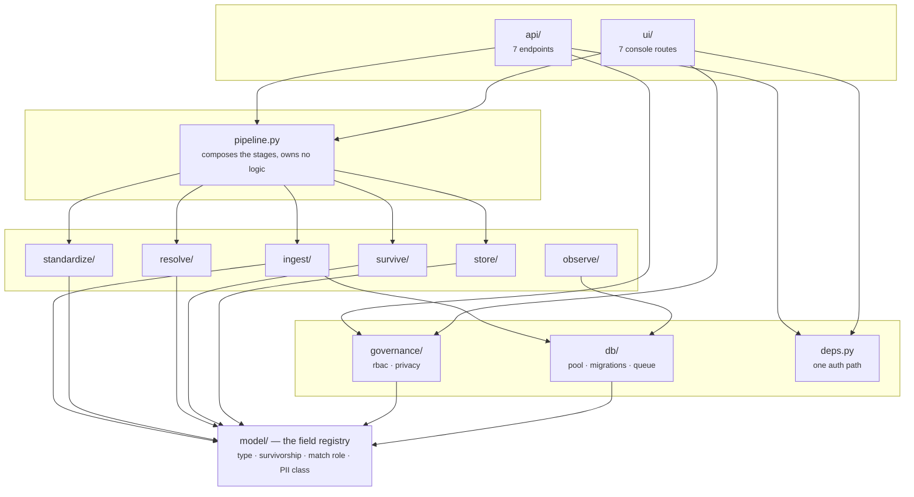
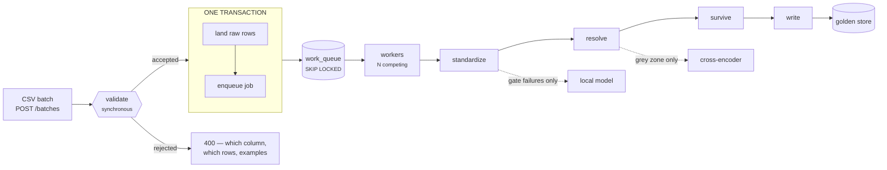
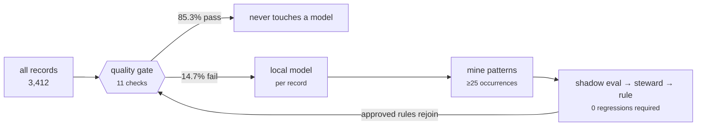
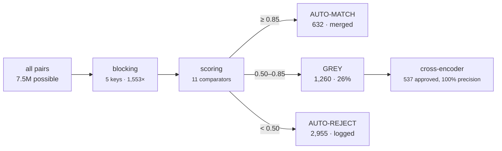

# Architecture

The layout of the system as built. Every figure here was measured against a real
PostgreSQL 16 instance on the 5,000-policy synthetic extract; reproduce with
`python -m scripts.generate_sample_data`.

| | |
|---|---|
| 43 Python modules | 12,182 lines |
| 5 migrations | 1,774 lines SQL, 21 tables |
| 401 tests | 4,004 lines, real Postgres |

---

## 1. Layering

Eleven packages in five bands. Dependencies run strictly downward — verified by
walking the import graph, not by convention.

**Why the registry is at the bottom.** It is pure standard library. A worker that
only normalizes text never imports Arrow, Postgres or FastAPI to learn what a
column means.

**One registry, three projections.** `model/fields.py` declares each attribute
once. The 986-line Postgres DDL, the Arrow schemas and the API contracts are all
generated from it, and a test regenerates the committed DDL and fails on drift.

> An `api ↔ ui` import cycle existed until this document was written — it only
> worked because the import was deferred inside `create_app()`. Removed by moving
> the shared request dependencies down a band into `cmdm/deps.py`.

---

## 2. Runtime path

Landing the rows and enqueueing the job are **one commit**. With a separate
broker they are two, and the window between them is where a batch becomes
accepted-but-lost — the API returns 202, the publish fails, and the data sits in
a table nothing will ever read.

Verified: six workers draining 300 jobs claimed 300 with zero overlaps.

### The six stages

| # | Stage | What it does | Where |
|---|---|---|---|
| 01 | **Land** | Every row verbatim, content-addressed. Only mapped columns kept. | `ingest/landing.py` |
| 02 | **Shred** | One policy row → 1 Policy, N Person, N Relationship. 37,700 policies/s. | `ingest/shred.py` |
| 03 | **Standardize** | Vectorized kernels → quality gate → local fallback → rule mining. | `standardize/` |
| 04 | **Resolve** | Blocking (1,553×) → tri-zone scoring → cross-encoder → graph merge. | `resolve/` |
| 05 | **Survive** | Registry-declared rule per attribute, one group-by, full lineage. | `survive/engine.py` |
| 06 | **Write** | SCD-2, never in place. Identical rewrite is a no-op. | `store/writer.py` |

---

## 3. Where AI enters

Two places, both gated, both audited. Model cost tracks how *ambiguous* the data
is, not how much of it there is.

### Standardization — per record

Measured, same batch on a second run: **AI share 14.7% → 0.0%**, 502 records
permanently retired from the model path, zero regressions.

### Resolution — per candidate pair

The grey zone is a first-class outcome, not a failure. A binary threshold forces
a call on every pair including the ones the evidence cannot support; a three-way
split lets the cheap scorer decline. On this run the cross-encoder contributed
**46% of all true positives at 100% precision**.

---

## 4. Storage

21 tables in one `mdm` schema, five forward-only migrations. Three of these
groups exist so the other two can be explained.

| Group | Tables | Why |
|---|---|---|
| **Canonical entities** | `policy` `person` `relationship` | The golden records. SCD-2, one current version per identity enforced by a partial unique index. |
| **Identity anchors** | `policy_master` `person_master` | Versioned tables can't back a foreign key — the surrogate repeats per version — so every FK targets these. Also where a merged-away id keeps existing. |
| **Evidence** | `source_record` `person_xref` `policy_xref` `attribute_provenance` | Where every golden value came from. The crosswalk is where identity actually lives. |
| **Decisions** | `match_pair` `resolution_run` `match_audit` `standardization_exception` `standardization_rule` | Every resolution decision *including rejections*, every AI invocation, every learned rule with its shadow results. |
| **Pipeline** | `work_queue` `ingest_batch` | The queue, in the same database so accept-and-enqueue is one commit. |
| **Governance** | `principal` `access_log` `steward_action` `consent` `erasure_request` | `access_log` refuses UPDATE and DELETE at the database. |

`001_golden_schema.sql` is generated from the registry and drift-tested. `002`–`005`
are hand-written operational machinery — putting queue plumbing into the registry
that describes what a Person *is* would be a category error.

---

## 5. Process topology

| Process | Serves | Scaling |
|---|---|---|
| `uvicorn cmdm.api.app:app` | REST API, both consoles, `/metrics` | Horizontal. Stateless; one pooled connection and one transaction per request. |
| pipeline worker | Claims from `work_queue`, runs stages 02–06 | Horizontal. SKIP LOCKED gives disjoint claims; leases return a crashed worker's jobs. |
| rule miner | Mines the exception log, proposes and shadow-tests rules | Scheduled, single instance. Proposes only — a steward approves. |

**Not yet built:** the worker daemon. Batches land and enqueue correctly and the
queue is proven under concurrency, but nothing drains it on a loop —
`run_pipeline()` is currently called directly. That is a supervisor loop around
`WorkQueue.claim`, not a design gap.

---

## 6. What the numbers rest on

- **No pretrained model was ever loaded.** The environment blocks model downloads,
  so both AI paths run real ONNX graphs built locally and both fallbacks are
  genuine second implementations rather than stubs. A real MiniLM cross-encoder's
  accuracy here is **unmeasured** — 0.991 / 0.780 belong to the feature encoder.
- **Ground truth is synthetic.** Two generator flaws had to be fixed before the
  numbers meant anything: emails derived from names alone gave different people
  identical addresses (precision read 0.687 until found), and organization owners
  inherited a person's customer id, penalising the matcher for correctly refusing
  to merge a company with a human.
- **Recall is a dial, not a result.** 0.780 reflects an AI acceptance threshold of
  0.70 trading against 0.991 precision. Blocking recall is 99.2%, so the ceiling
  is not the constraint — the threshold is, and it should be set against real data
  and a real tolerance for false merges.
