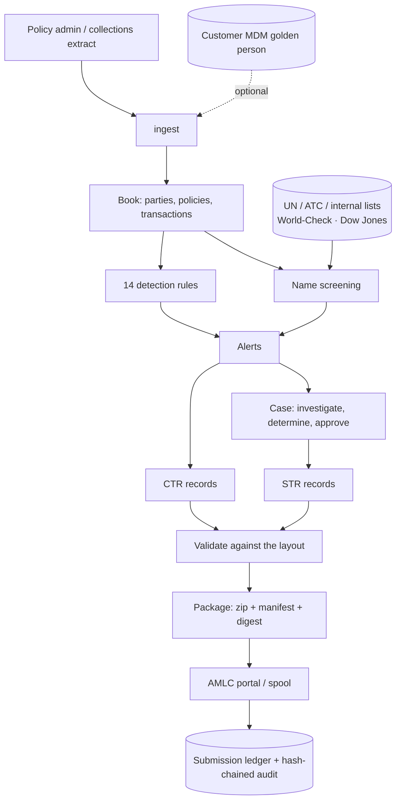

# AML and Transaction Monitoring

A covered person's AML obligations, built on the customer data the rest of this
repository curates: detect covered and suspicious transactions, screen names
against sanctions and PEP lists, investigate under a four-eyes workflow, and
file CTRs and STRs with the AMLC.

Audience: an insurance covered person supervised by the Insurance Commission
in the Philippines.

The code is `src/aml`. It is **pure standard library** — no Arrow, no
PostgreSQL, no HTTP client library — because it is deployed into compliance
units where every added dependency is a security review, and because the
machine that talks to the AMLC portal is usually the most locked-down one in
the building. It runs standalone against a flat extract, and reads the golden
customer record when the MDM is deployed beside it.

---

## 0. Assumptions taken

Four questions were unanswered when this was built. Each default below is cheap
to change now and expensive later, so flag any you disagree with.

| # | Decision | Taken | Why |
|---|---|---|---|
| 1 | **The AMLC file layout** | Field layouts are **data** (`src/aml/report/specs/*.toml`), not code. What ships is a complete working layout carrying the particulars the AMLA requires, under this package's own column names. | The published schema is versioned by the AMLC, not by us, and a covered person finds out it changed when a submission is rejected days before a deadline. Reconciling a TOML file is an afternoon; recompiling a hardcoded writer is a release. **This is the one thing that must be reconciled against the AMLC's current registration and reporting guidelines before the first live filing.** |
| 2 | **Submission channel** | `spool` by default: the exact package is written to a directory with its digest and a manifest, for a person to upload through the portal. `http` drives the portal directly once its endpoints and the institution's enrolment credentials are configured. | Portal endpoints and enrolment differ per covered person and are not public. Spool is not a stub — it produces byte-identical packages and records them in the ledger the same way — so the tool is fully usable on day one, and turning on `http` changes one configuration line. |
| 3 | **Same-day aggregation** | On by default: several transactions by one client in one banking day are added together before the PHP 500,000 threshold is applied. | The statute speaks of a transaction "in one banking day" and institutions read it both ways. A client paying 300,000 twice in a morning is exactly what the threshold exists to surface. Over-reporting is a filing cost; under-reporting is a violation. Switch it off with `thresholds.aggregate_same_day = false`. |
| 4 | **Screening vendor** | Provider-agnostic. World-Check One and Dow Jones Risk & Compliance clients ship, alongside a local-list provider for UN and domestic designations and internal watchlists. **Scoring and thresholds are ours, not the vendor's.** | Vendor match scores are not comparable to each other, and an institution should not have the meaning of "0.85" change when it changes supplier. The vendor's score is kept as evidence and used as a floor. |

Two further defaults worth stating:

- **Nothing is auto-confirmed and nothing is auto-filed.** The strongest
  screening outcome the system produces is `POTENTIAL_MATCH`; confirming a
  sanctions match freezes a client's property, and a person's name goes against
  that. Filing requires a determination by one person and an approval by
  another.
- **Money is `Decimal`, and a peso equivalent is mandatory.** A transaction with
  no reference rate for its date is an ingest **error**, not a warning: the
  threshold test is in pesos, and treating a dollar figure as pesos understates
  it roughly fifty-six-fold.

---

## 1. What it does



### The two reporting paths are genuinely different

A **covered transaction** is reported because of what it is: cash or an
equivalent monetary instrument exceeding PHP 500,000 in one banking day. Nobody
has to find it suspicious, and failing to report it is a violation on its own.
It goes straight from detection to a CTR.

A **suspicious transaction** is reported because a human determined it to be
suspicious, citing at least one of the statutory circumstances ST1–ST7. The
five-working-day clock runs from *that determination* — not from the alert, not
from the transaction — which is why determination is a recorded event with a
timestamp and an author.

---

## 2. Detection

Fourteen rules, `aml rules` prints the catalogue for the AML manual. Two detect
covered transactions; twelve evidence suspicion and each declares the statutory
circumstance it relies on.

| Rule | Finds | ST |
|---|---|---|
| `ctr.single_transaction` | One transaction over the threshold | — |
| `ctr.same_day_aggregate` | A banking day that aggregates over it | — |
| `str.structuring` | A cluster just below the threshold, within a window | ST4 |
| `str.early_surrender` | Large premium, then surrender or free-look cancellation | ST1, ST5 |
| `str.third_party_payer` | Premium paid by, or proceeds paid to, an unrelated party | ST1, ST5 |
| `str.overpayment_refund` | Overpayment refunded, especially to another account | ST1 |
| `str.rapid_movement` | Paid in, withdrawn again, policy left in force | ST1, ST5 |
| `str.beneficiary_churn` | Repeated changes, or a change just before a payout | ST5 |
| `str.income_capacity` | Activity against declared financial capacity | ST3 |
| `str.profile_deviation` | A month far outside the client's own baseline | ST5 |
| `str.high_risk_jurisdiction` | Counterparty in a listed jurisdiction | ST5, ST6 |
| `str.incomplete_identification` | Material activity, incomplete CDD | ST2 |
| `str.pep_activity` | Material activity by a PEP | ST3, ST5 |
| `str.designated_party` | Any transaction touching a designated person | ST6 |

Three properties the rules hold to:

**Findings, not booleans.** Every rule returns the transactions it fired on, the
peso amounts it compared, the ST codes it evidences, and a narrative in plain
language. That narrative is the first draft of the STR — the part the AMLC
actually reads — and a rule that can only say "score 0.82" has pushed the whole
explanatory burden onto an analyst who has fifty other alerts.

**Reproducible.** Rules are pure functions of the book and the configuration: no
clock, no database, no network. Two runs over the same extract produce identical
alerts with identical identifiers. `MonitoringRun.fingerprint` digests the
thresholds and every rule's version and effective parameters, so "what was the
system looking for in March?" has an answer.

**Independent.** A rule that raises is recorded as a failed rule and the run
continues. A defect in beneficiary-churn detection must not suppress the
covered-transaction detection that has a statutory deadline attached.

Alerts are identified by *what they found* — rule, subject, transactions, window
— so re-running monitoring after a threshold change updates the existing alert
instead of duplicating it, and never reopens one an analyst has already
dispositioned.

---

## 3. Name screening

Screening is a recall problem with a precision budget. The matcher is built for
the names an insurer here actually holds:

| Compared | Score | Why it matters |
|---|---|---|
| `Juan Dela Cruz` / `Juan de la Cruz` | 1.00 | Spanish particles are joined to the surname |
| `Juan Dela Cruz` / `JUAN DELACRUZ` | 1.00 | Same |
| `Ma. Teresa Santos-Reyes` / `Maria Teresa S. Reyes` | 0.95 | `Ma.` expands; an initial is partial agreement |
| `Faisal Ahmad Rahman` / `Faisal A. Rahman` | 0.94 | Exact token assignment, not greedy |
| `Ali Hassan Abdullah` / `Aly Hasan Abdulla` | 0.96 | Phonetic key catches transliteration |
| `Juan Dela Cruz` / `Maria Santos` | 0.23 | Unrelated names stay far from the threshold |

Corroboration then adjusts: a matching identification number settles it (0.99),
an agreeing date of birth lifts, a conflicting one by a decade subtracts 0.20, a
natural person against a legal entity multiplies by 0.75 — and every adjustment
is recorded as a sentence on the hit, because clearing a match as a false
positive means overruling those reasons.

Two rules that exist for specific failure modes:

- **A sanctions floor.** A near-exact name against a designated person is raised
  for a human even when the corroborating attributes pull the score below the
  review threshold. Those attributes came from the client; a client who supplies
  a false date of birth must not be able to screen themselves out.
- **A provider failure is never a clean screening.** A vendor timeout leaves the
  result `PENDING` with the error attached. A screening gap that looks like "no
  match" is the worst failure this component has, because nobody returns to it.

Negatives are recorded too. "We screened this client against these lists on this
date and found nothing" is exactly what an examiner asks a covered person to
evidence, and it cannot be reconstructed from an empty table.

---

## 4. Workflow, deadlines and the audit record

```
alert ──open──> case ──determine──> PENDING_APPROVAL ──approve──> APPROVED ──file──> FILED
                  │                   (analyst)         (a second person)
                  └──close (reason mandatory)──> CLOSED_NOT_REPORTABLE
```

- **Four eyes.** `approve` refuses when the approver is the person who
  determined the case. Both false filings and quiet non-filings are single-pair-
  of-eyes failures.
- **Deadlines in working days, on the Philippine calendar.** Weekends, the
  regular holidays, the two derived from Easter, and the special non-working
  days on which banks are shut. A determination on 30 March 2026 is due 8 April
  — nine calendar days later, because Holy Week is in the way. Eid'l Fitr,
  Eid'l Adha and proclaimed special days cannot be derived and are loaded from
  configuration; `aml config` warns for any year where none are loaded rather
  than computing deadlines on an optimistic calendar.
- **A separate, shorter clock** for designated persons and terrorism financing:
  freeze without delay, report in hours. Those cases are CRITICAL and sort to
  the top of `aml due`.
- **Reasons are mandatory** wherever something is closed without being reported.
  An alert closed with no reason is indistinguishable, to an examiner, from an
  alert nobody looked at.
- **A late filing is recorded as late.** The audit entry carries `late: true`
  rather than quietly normalising it.
- **No tipping off.** Nothing in the workflow notifies anyone outside the
  compliance function.

Every state change is appended to a hash chain — each entry carries the digest
of the one before it. Altering or deleting any entry breaks every hash after it,
and `aml verify` says which one and what happened to it:

```
$ aml verify
audit chain intact: 28 audit entries verified
```

That does not make the record unalterable. It makes alteration *detectable*,
which is the property that matters when the question is whether an alert was
quietly closed after the fact.

**Why SQLite** when the MDM beside it insists on PostgreSQL: this is a
compliance unit's case ledger, written by one team, retained five years, and
handed over whole. "Here is the file, and here is the command that proves it has
not been altered" is a better answer to an examiner than a database dump nobody
can verify — and it opens on a laptop. Nothing in the schema depends on SQLite;
an institution wanting it beside the golden store can point it at PostgreSQL.

---

## 5. Filing

Records are built into canonical mappings, projected through the layout,
validated, rendered, packaged and submitted:

- **A transaction is reported once**, even when two rules found it.
- **References are derived from content**, so regenerating a batch after a
  correction produces the same reference rather than a second report.
- **Validation before submission**, not after rejection: mandatory fields,
  lengths, patterns, unmapped codes, duplicate references. Blocking issues stop
  the file being written unless `--force`.
- **Rendering is deterministic** and packaging is too — fixed zip timestamps,
  sorted entries — so the same reports produce the same digest, which is what
  proves years later that the file the AMLC holds is the file this produced.
- **Submission is idempotent**: identity is the package digest, so a retry after
  a timeout finds the existing submission rather than filing twice.
- Packages may be encrypted (AES-256-GCM, PBKDF2). If `cryptography` is missing
  or broken, packaging **refuses** rather than falling back to plaintext.

---

## 6. Measured

All figures from `python -m aml.console demo`, which writes a synthetic book
with one instance of each typology planted in a known place and an answer key
beside it (`ANSWER-KEY.md`). The test suite asserts against that answer key.

| Stage | Result |
|---|---|
| Extract | 454 transactions, 60 clients, 81 policies, one of them USD-denominated |
| Monitoring | 14 rules over the whole book in **18 ms** |
| Detection | **10 of 10** planted typologies found |
| False positives | **0** alerts against the 50 ordinary premium payers |
| Covered transactions | 13, including a USD 20,000 premium that only crosses the threshold once converted |
| Screening | 60 subjects, 1 designated-person match at 1.00, 0 false positives |
| Reproducibility | Two runs, identical alert identifiers and fingerprint |
| Re-running | Second monitoring run creates **0** new alerts, updates 24 |
| Reports | 13 CTR rows and 1 STR row, 0 blocking validation issues |
| Packaging | Byte-identical archives across runs |
| Audit | Every entry of the demonstration pipeline verified; a single altered or deleted row is detected and named |
| Tests | **99 passing in 2.3 s**, no database and no network |
| Types | `mypy --strict` clean over 46 modules |

---

## 7. Before this files anything real

In order of importance:

1. **Reconcile the report layouts** (`src/aml/report/specs/*.toml`) against the
   schema published with the AMLC's current registration and reporting
   guidelines for your covered person type. Column names, code values and file
   naming are the parts that are ours rather than theirs.
2. **Fill in `[institution]`.** Submission refuses to proceed without the AMLC
   institution code and a named compliance officer; `aml config` lists what is
   missing.
3. **Confirm the covered-instrument interpretation** in
   `thresholds.covered_instruments` and record it in the AML manual. Whether an
   InstaPay credit is "an equivalent monetary instrument" is a documented
   institutional position, not a technical detail.
4. **Load the proclaimed holidays** for the current and next year.
5. **Load real lists.** The demonstration watchlist is fabricated. Point
   `screening.local_lists` at the UN consolidated list and the domestic
   designations, and configure the vendor tenant if you have one.
6. **Confirm the vendor payload mapping.** World-Check and Dow Jones request and
   response shapes vary by tenant and API version; everything version-specific
   is confined to one mapping table and one method per provider.
7. **Tune the thresholds against your own history** before go-live. Every rule's
   parameters are configuration, and `--as-of` lets you backtest a proposed
   change against last quarter without contaminating it with what happened
   since.

## 8. Open questions

- **Aggregation window.** Same-day aggregation is on. Should it also aggregate
  across a client's related parties — spouse, household, corporate affiliates —
  which the MDM can already resolve?
- **Where the KYC attributes come from.** Declared income, source of funds and
  PEP status drive three rules and are not in the golden record today. They live
  in the KYC file; a feed would improve ST3 detection considerably.
- **Customer risk rating.** Risk-based monitoring wants a rating per client
  (product, channel, jurisdiction, PEP, occupation). The field is modelled and
  carried; the scoring model is not built.
- **Portal acknowledgement polling.** In `spool` mode the acknowledgement is
  recorded by hand. In `http` mode the status endpoint is implemented but the
  polling loop is not scheduled.
